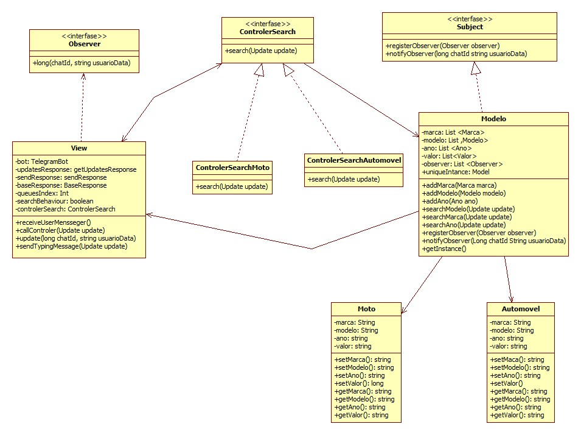

# CarPrices1B

# Sobre
Bot para telegram escrito em java, utilizando os conceitos de MVC utilizando o modelo providenciado pelo professor. Ele tem como objetivo permitir utilizar um bot de pesquisas para verificar o valor de um veículo.

Desenvolvido pelos alunos Gisele, Jéssica e Jonas, alunos de Análise e Desenvolvimento de Sistemas na FATEC São José dos Campos.

# Funcionamento

>Nesta tela há um exemplo de como fazer uma pesquisa de uma marca específica.
Ao digitar a marca, é retornado o código na FIPE da mesma.

>Aqui, está sendo representada uma pesquisa pela marca de um veículo específico.

>Ao digitar "Valor", são solicitados os seguintes dados, um de cada vez: Marca, Modelo e Ano. Após digitados estes valores, é retornado o preço do veículo desejado.(É necessário digitar o nome do veículo de acordo com o que está escrito na FIPE)

>Abaixo está o diagrama de classes do projeto.

